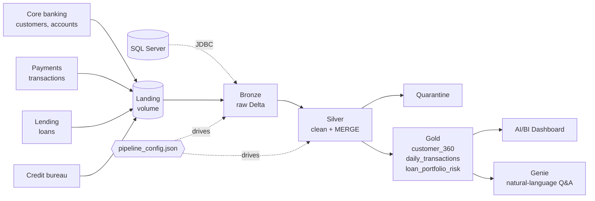

# NeoBank Lakehouse

**A metadata-driven Medallion pipeline on Databricks that unifies banking data into business-ready tables for risk and customer analytics.**


---

## The problem

NeoBank, a fictional digital bank, collects data from its **core banking system, payments platform, lending system, and an external credit bureau**.

- The data sits in **separate systems and formats**, so there's no single view of a customer.
- **Hand-built pipelines** for each source are slow to change and hard to scale.
- Business teams have **no self-service way** to answer operational and risk questions.

## The solution

| Layer | What happens | Tables |
|---|---|---|
| **Bronze** | Raw data landed as-is, with audit columns (`_ingest_ts`, `_source_file`, `_source_system`) | `bronze.customers`, `bronze.accounts`, `bronze.transactions`, `bronze.loans`, `bronze.credit_bureau` |
| **Silver** | Cleaned, typed, validated, de-duplicated, and upserted with `MERGE`. Bad rows go to quarantine tables. | `silver.*`, `silver.*_quarantine` |
| **Gold** | Business-ready tables for dashboards and Genie | `gold.customer_360`, `gold.daily_transactions`, `gold.loan_portfolio_risk` |

**Metadata-driven:** every source is described in [`config/pipeline_config.json`](config/pipeline_config.json): its format, path, primary key, load type, column types, and cleaning rules. The same notebooks process every source, so **adding a new source is a config change, not new code.** A SQL Server source is included as a disabled JDBC example, with credentials read from a Databricks secret scope.



## Repo structure

```
neobank-lakehouse/
├── config/
│   └── pipeline_config.json      # source metadata: paths, keys, types, rules
├── data/raw/                     # synthetic sample data (CSV)
├── notebooks/
│   ├── _common.py                # loads config, shared helpers
│   ├── 00_setup.py               # catalog, schemas, volume, copy sample data
│   ├── 01_bronze_ingest.py       # metadata-driven ingestion (CSV + JDBC)
│   ├── 02_silver_transform.py    # standardize, cast, validate, dedupe, MERGE
│   ├── 03_gold_aggregates.py     # customer 360, daily transactions, loan risk
│   └── 04_data_quality.py        # checks that fail the job on bad data
├── sql/dashboard_queries.sql     # queries behind each dashboard tile
├── docs/genie_setup.md           # Genie space instructions + sample questions
└── scripts/generate_sample_data.py
```

## How to run it

1. **Clone into Databricks:** Workspace → **Repos / Git folders** → *Add* → paste this repo's URL.
2. Open `notebooks/00_setup.py` and run it on a cluster or serverless compute. It creates the `neobank` catalog, the schemas and landing volume, and copies the sample CSVs.
   > No permission to create catalogs? Change `"catalog"` in the config to one you own.
3. Run `01_bronze_ingest` → `02_silver_transform` → `03_gold_aggregates` → `04_data_quality`.
   Or create a **Databricks Job** with these four notebooks as tasks, in that order.
4. Build a dashboard from [`sql/dashboard_queries.sql`](sql/dashboard_queries.sql) and set up Genie with [`docs/genie_setup.md`](docs/genie_setup.md).

## Gold tables at a glance

| Table | Example questions it answers |
|---|---|
| `customer_360` | Who are our high-risk customers? Which segment holds the most deposits? |
| `daily_transactions` | How is card spend trending? Which channel has the most declines? |
| `loan_portfolio_risk` | How much of the Auto loan book is 90+ days past due? |

## Data quality built in

- Blank strings become nulls and invalid values become nulls via `try_cast`, so a bad value never crashes the load.
- Rows missing required fields go to `silver.<table>_quarantine` with the reason.
- Duplicates are removed on the primary key, keeping the latest record.
- `04_data_quality` checks uniqueness, referential integrity, and value ranges, and **fails the job** if any check fails.

The sample data includes a duplicate transaction, a messy customer record, and a customer with no email to show these rules working.

## About the data

All data is **synthetic**, generated by `scripts/generate_sample_data.py` (fixed seed, so results are repeatable). It has 500 customers, about 660 accounts, about 14,000 transactions, 300 loans, and 1,000 credit-bureau records.

---

*Built by [Divya Yadlapalli](https://www.linkedin.com/in/divya-yadlapalli-divyayadlapalli/), inspired by the Medallion Architecture pattern used in modern Databricks lakehouses.*
